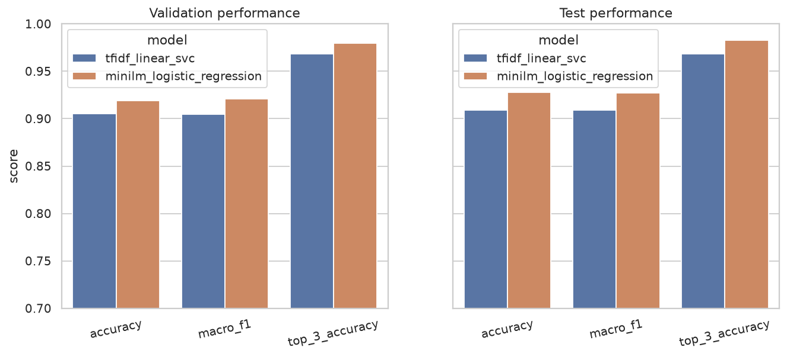
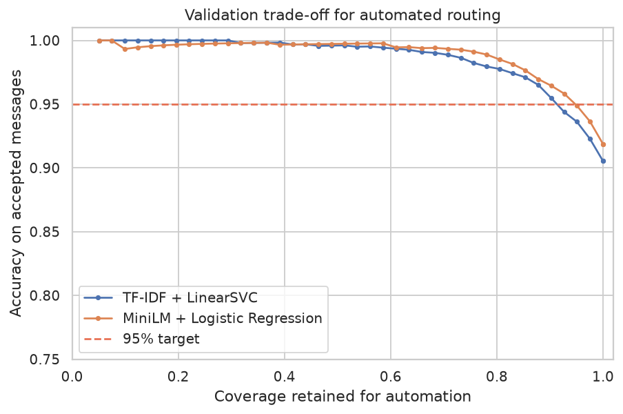
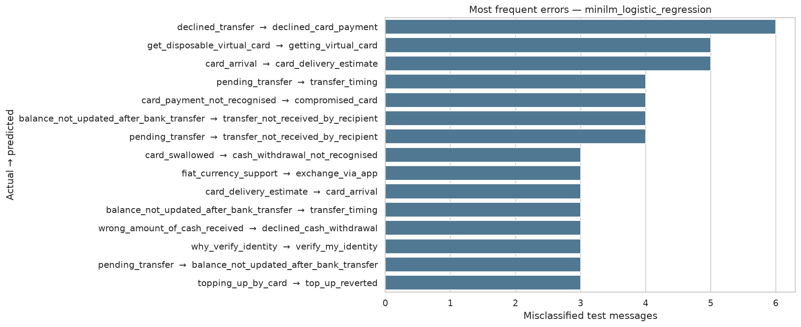

# Banking Support Intent Classification with Human Handoff

An end-to-end NLP project that routes customer-support messages across **77 banking intents**. It compares a strong sparse-text baseline with a transformer-backed semantic model, selects the champion on a validation split, evaluates once on the official test split, and sends uncertain messages to human review.


## Business problem

Banking support teams receive short, ambiguous messages such as “cash not received,” “transfer stuck,” or “card still coming.” Correctly identifying the intent can speed up routing, but blindly automating uncertain predictions creates a poor customer experience.

This project therefore answers two questions:

1. How accurately can a model classify a message into one of 77 fine-grained intents?
2. When should the model abstain and route the message to a support specialist?

## Verified results

Model choice and the confidence threshold were fixed using a stratified validation split. The official 3,080-message test split was then used for final reporting.

| Model | Test accuracy | Test macro-F1 | Test top-3 accuracy |
|---|---:|---:|---:|
| Word + character TF-IDF, LinearSVC | 90.9% | 90.9% | 96.8% |
| **MiniLM embeddings, Logistic Regression** | **92.8%** | **92.7%** | **98.3%** |

The MiniLM model was selected because it achieved the stronger validation macro-F1. Its validation-chosen handoff threshold produced the following untouched test-set operating result:

- **92.7% automation coverage** — 2,855 of 3,080 messages accepted
- **95.9% accuracy on accepted messages**
- **225 uncertain messages routed to human review**

The repository also reports a sensitivity check after removing the six exact text overlaps found between the official train and test files. MiniLM accuracy remained **92.7%**, so the headline result is not driven by those overlaps.





## Models

### 1. Sparse-text baseline

- Word TF-IDF with unigrams and bigrams
- Character TF-IDF with 3–5 character n-grams
- Linear Support Vector Classifier
- Confidence signal: gap between the two highest decision scores

This baseline is fast, interpretable, compact, and surprisingly competitive.

### 2. Transformer-backed semantic model

- Pretrained `sentence-transformers/all-MiniLM-L6-v2` encoder
- Normalized 384-dimensional sentence embeddings
- Multinomial Logistic Regression classifier
- Confidence signal: maximum predicted class probability

The encoder is used as a frozen feature extractor; this repository does **not** claim that MiniLM was fine-tuned. That design keeps training feasible on a laptop while still testing whether transformer semantics improve over TF-IDF.

## Methodology

1. Validate schema, missing values, duplicates, label coverage, and split overlap.
2. Reserve 15% of the official training data as a stratified validation set.
3. Train both model families on the remaining development data.
4. Select the champion using validation macro-F1 so all 77 intents matter.
5. Choose a confidence threshold on validation data to target at least 95% accuracy among automated predictions.
6. Retrain both models on the complete training split.
7. Evaluate them once on the untouched official test split.
8. Generate per-intent metrics, confusion pairs, low-confidence errors, tests, model artifacts, and an interactive application.

## Error analysis

The most difficult distinctions are operationally similar intents, including:

- declined transfer vs. declined card payment
- getting a disposable virtual card vs. getting a standard virtual card
- card arrival vs. card delivery estimate
- pending transfer vs. transfer timing or recipient not receiving a transfer

This is why the app shows the top three suggestions and supports a human-review path instead of forcing every prediction.



Detailed outputs are committed in:

- `reports/metrics.json`
- `reports/model_comparison.csv`
- `reports/champion_per_class_metrics.csv`
- `reports/champion_confusion_pairs.csv`
- `reports/misclassified_examples.csv`
- `reports/test_predictions.csv`

## Repository structure

```text
banking-intent-classifier/
├── app/app.py
├── data/raw/
│   ├── train.csv
│   ├── test.csv
│   └── categories.json
├── models/
│   ├── tfidf_linear_svc.joblib
│   └── minilm_logistic_regression.joblib
├── notebooks/01_banking77_model_analysis.ipynb
├── reports/
│   ├── figures/
│   ├── metrics.json
│   └── model_comparison.csv
├── src/banking_intent/
├── tests/
├── INTERVIEW_GUIDE.md
├── MODEL_CARD.md
├── RESUME_BULLETS.md
├── predict.py
└── run_pipeline.py
```

Embedding caches are intentionally excluded from Git because they can be reproduced and would make the repository unnecessarily large.

## Run locally

Create and activate a virtual environment, then install dependencies:

```bash
python -m venv .venv
```

Windows:

```bash
.venv\Scripts\activate
pip install -r requirements.txt
python run_pipeline.py
python -m unittest discover -s tests -v
streamlit run app/app.py
```

macOS/Linux:

```bash
source .venv/bin/activate
pip install -r requirements.txt
python run_pipeline.py
python -m unittest discover -s tests -v
streamlit run app/app.py
```

The first transformer run downloads `all-MiniLM-L6-v2`. The pretrained encoder itself is not committed to this repository.

Classify one message from the command line:

```bash
python predict.py "The cash machine charged me but gave no cash" --model transformer
```

## Dataset and licensing

The project uses [BANKING77](https://github.com/PolyAI-LDN/task-specific-datasets/tree/master/banking_data), introduced in [BANKING77: Intent Detection on Online Banking Queries](https://aclanthology.org/2020.nlp4convai-1.5/).

- The dataset is licensed under CC BY 4.0.
- Project code is licensed under MIT.
- Dataset attribution and file-level details are in `data/README.md`.

## Responsible-use note

This is a portfolio and educational project, not a production banking system. BANKING77 contains example service queries rather than a complete bank-specific taxonomy. Before deployment, teams would need domain-specific validation, privacy controls, drift monitoring, multilingual testing, latency/load testing, escalation procedures, and review of the economic cost of routing mistakes.

## Author

**Burra Vijyusha**  
B.Tech, Metallurgical Engineering and Materials Science  
Indian Institute of Technology Indore

